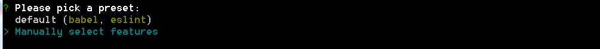
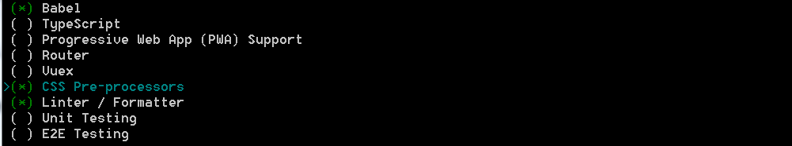
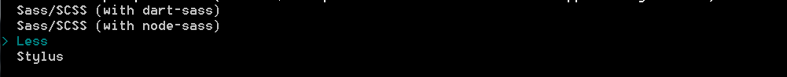
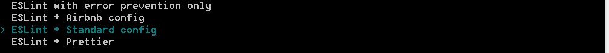
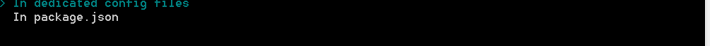
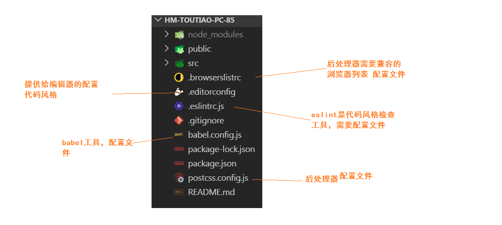
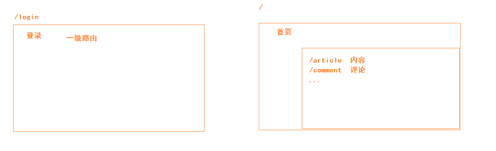
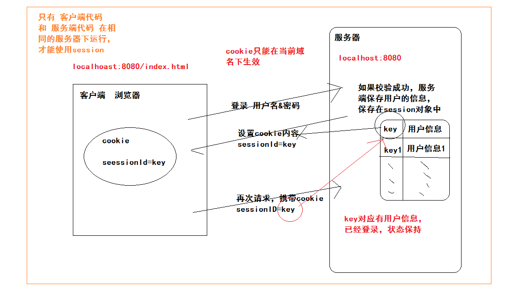
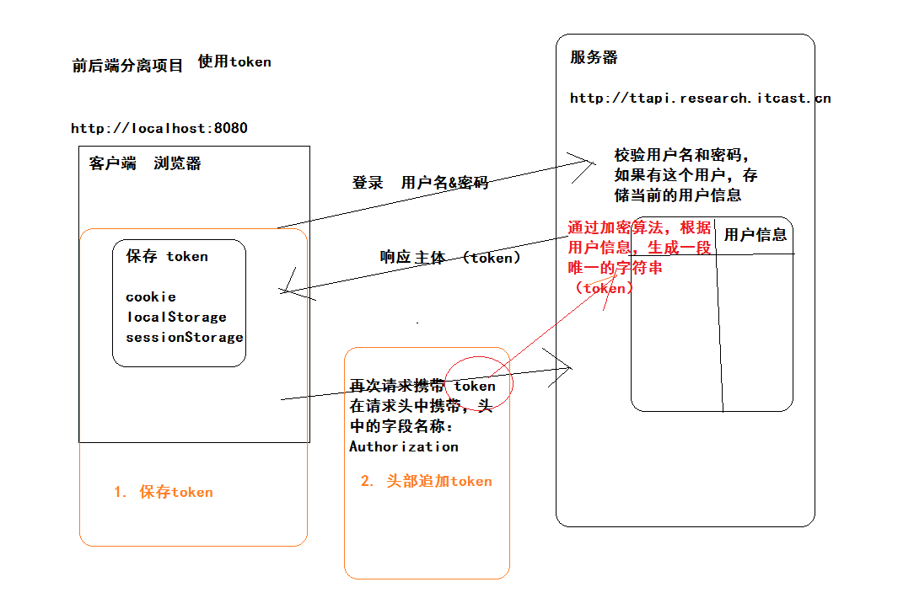
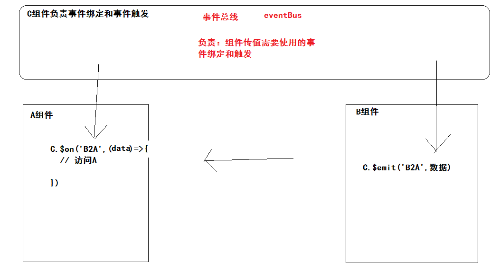

### 01-项目介绍

​		是一个类似于今日头条APP的后台管理系统。

- 登录
- 后台首页
- 内容管理
- 素材管理
- 发布文章
- 评论管理
- 粉丝管理
- 个人设置

### 02-准备工作

- vue基础
- vue-cli 脚手架2.0 （3.0|4.0 差别不大）
- axios 发请求
- vue-router  基础vue插件  路由
- 接口文档
- element-ui的框架构建
  - 饿了么前端团队开发UI组件库（UI框架）
  - 基与vue的组件库
- git与github

### 03-初始化项目

vue-cli 2.0

```bash
vue init webpack -simple 项目名称
```

vue-cli 3.0|4.0

```bash
vue create 项目名称
```

第一步：选择自定义初始化



第二步：选中babel css预处理器  代码风格工具



第三步：选择预处理器 less



第四步：选择代码风格



第五步：保存代码和提交代码 检查风格


第六步：不同的工具生成不同的配置文件



第七步：是否记录刚才的操作


安装项目依赖....

安装结束：

```bash
cd hm-toutiao-pc-85
npm run serve
```


解释配置文件



**src目录进行调整**

```bash
├─api #接口
├─assets #静态资源
├─components #公用组件
├─directive #指令
├─filter #过滤器
├─router #路由
├─utils #工具函数
└─views # 路由级别组件
└─App.vue # 根组件
└─main.js # 入口文件
```

以上结构参考。


### 04-项目-分支管理

第一件事情：把本地的仓库推送远程仓库

```bash
# 把远程仓库的地址取一个别名：origin
git remote add origin git@github.com:zhousg/hm-toutiao-pc-85.git
# -u 记录这次提交  再次提交：git push 即可。
git push -u origin master
```

第二件事情：通过分支来管理项目代码

- 分支作用
  - 一个人开发，通过分支维护不同功能模块的代码
  - 当不同的人使用不同的分支来开发不同的功能，协同开发。

假设开发登录：

- 创建登录分支：git branch login
- 切换到登录分支：git checkout login
- 开发功能（若干小功能组成）
  - 开发一个小功能完成：git add .  ---> git commit -m '备注'
  - ...
- 开发完毕
  - 切换master分支：git checkout master
  - 合并login分支：git merge login

最终愿望：

- 大家在github查看老师每次实现一个功能的代码提交情况（删除 修改 添加）
- https://github.com/zhousg/hm-toutiao-pc-85/

### 05-项目-使用element-ui

- 文档：https://element.eleme.cn/#/zh-CN
- 在项目中使用UI组件库步骤：

安装：

```bash
# -S 是 --save 简写   作用：安装在运行时依赖，上线使用。生产依赖。
# 如果 npm 的版本在5.0以上可以省略
npm i element-ui -S
```

 使用：main.js

```diff
import Vue from 'vue';
+import ElementUI from 'element-ui';
+import 'element-ui/lib/theme-chalk/index.css';
import App from './App.vue';
+ // ElementUI 是一个插件  集成了很多组件
+Vue.use(ElementUI);

new Vue({
  el: '#app',
  render: h => h(App)
});
```

测试：

```html
<div id="app">
    hm-toutiao-pc-85 <el-button type="success">成功按钮</el-button>
  </div>
```


### 06-项目-配置vscode的eslint插件

- 安装vscode的时候，安装一个插件 `prettier` ， 作用是格式化代码。
  - 卸载：`prettier` 
  - 在setting.json文件中，注释对应的配置，禁用。
  - 建议大家：去掉自动保存功能。
- 安装插件eslint，作用约束代码风格，自动修复风格，格式化代码。

添加eslint的配置，setting.json文件中。

```json
  "eslint.validate": [
    "javascript",
    "javascriptreact",
    {
      "language": "vue",
      "autoFix": true
    }
  ],
  "eslint.autoFixOnSave": true,
```


### 07-项目-使用vue-router

安装：

```bash
npm i vue-router
```

引入：/src/router/index.js

```js
import VueRouter from 'vue-router'
```

使用：

```js
import Vue from 'vue'
Vue.use(VueRouter)
```

实例化：

```js
const router = new VueRouter({
  // 路由配置对象
  // 关键选项：routes 作用：配置路由规则
  routes: []
})
```

导出：

```js
export default router
```

导入：main.js

```js
// 1. 导入某一个目录，默认会去找索引文件（index.js index.vue index.json） 基于webpack
// 2. @ 别名  指定的是 /src 路径  一个绝对路径。 基于webpack
import router from '@/router'
```

挂载：

```diff
new Vue({
+	router,
  render: h => h(App)
}).$mount('#app')
```


### 08-项目-路由规则分析

分析：



结果：

| 路径       | 组件（功能） | 路由级别 |
| -------- | ------ | ---- |
| /login   | 登录     | 一级路由 |
| /        | 首页     | 一级路由 |
| /        | 欢迎组件   | 二级路由 |
| /article | 内容管理组件 | 二级路由 |
| /image   | 素材管理组件 | 二级路由 |
| /publish | 发布文章组件 | 二级路由 |
| /comment | 评论管理组件 | 二级路由 |
| /fans    | 粉丝管理组件 | 二级路由 |
| /setting | 欢迎组件   | 二级路由 |


### 09-登录模块-路由及组件创建

创建组件：src/views/login/index.vue

```html
<template>
  <div class='container'>Login</div>
</template>

<script>
export default {}
</script>

<style scoped lang='less'></style>
```

进行路由配置：src/router/index.js

```js
import Login from '@/views/login'
```

```diff
const router = new VueRouter({
  routes: [
    // 登录
+    { path: '/login', component: Login }
  ]
})
```

添加一个一级路由的容器：App.vue

```html
  <div id="app">
    <!-- 一级路由的容器 -->
    <router-view />
  </div>
```


### 10-登录模块-基础布局

- 全屏容器
- 卡片容器

```html
<template>
  <!-- 全屏容器 -->
  <div class='container'>
    <!-- 卡片容器  el-card是一个element组件，根元素上默认添加一个类和组件的名称一致 -->
    <el-card>
      
    </el-card>
  </div>
</template>

<script>
export default {}
</script>

<style scoped lang='less'>
.container{
  width: 100%;
  height: 100%;
  background: pink;
  position: absolute;
  left: 0;
  top: 0;
  // 背景图尺寸：拆分写法 background-size
  // 组合写法：background:..... / 背景图尺寸(width,height)
  // 特殊写法：cover  等比例缩放铺满容器多余不显示  contain 等比例缩放完全显示在容器内
  background: url(../../assets/login_bg.jpg) no-repeat center / cover;
  .el-card{
    width: 400px;
    height: 350px;
    position: absolute;
    left: 50%;
    top: 50%;
    transform: translate(-50%,-50%);
    img{
      width: 200px;
      display: block;
      margin: 0 auto;
    }
  }
}
</style>
```


### 11-登录模块-绘制表单

分析表单组件结构：

```html
<!-- el-form 表单容器 -->
<!-- ref="form" ref作用获取被标记的 dom元素|组件实例  -->
<!-- label-width="80px" 设置 说明文字容器宽度 -->
<!-- :model="form" 属性绑定 表单的数据对象-->
<el-form ref="form" :model="form" label-width="80px">
  <!-- el-form-item 表单容器  label="活动名称" 指定说明文字 -->
  <el-form-item label="活动名称">
    <!-- 表单元素 -->                  
    <el-input v-model="form.name"></el-input>
  </el-form-item>
  <el-form-item>
    <el-button type="primary" @click="onSubmit">立即创建</el-button>
    <el-button>取消</el-button>
  </el-form-item>
</el-form>
```


使用表单组件在页面中：

结构：

```html
<!-- 表单 -->
      <el-form :model="LoginForm">
        <el-form-item>
          <el-input v-model="LoginForm.mobile" placeholder="请输入手机号"></el-input>
        </el-form-item>
        <el-form-item>
          <el-input v-model="LoginForm.code" placeholder="请输入验证码" style="width:240px;margin-right:8px"></el-input>
          <el-button>发送验证码</el-button>
        </el-form-item>
        <el-form-item>
          <el-checkbox :value="true">我已阅读并同意用户协议和隐私条款</el-checkbox>
        </el-form-item>
        <el-form-item>
          <el-button type="primary" @click="onSubmit" style="width:100%;">登录</el-button>
        </el-form-item>
      </el-form>
```

数据：

```js
export default {
  data () {
    return {
      LoginForm: {
        mobile: '',
        code: ''
      }
    }
  }
}
```

样式：

```diff
    img {
      width: 200px;
      display: block;
+      margin: 0 auto 30px;
    }
```

### 12-登录模块-添加校验

- el-form 上添加属性  rules  值是  校验规则对象
- el-form-item 上添加属性  prop  值是  当前字段的名字

```js
data () {
  return {
      loginForm:{
      	name:''                                                        
      }                
      rules: {
				name: [
          {},{}              
        ]	  	                                                           
      }                
  }
}
```

使用的步骤：

```html
      <!-- 表单 -->
      <el-form :model="LoginForm" :rules="LoginRules">
        <el-form-item prop="mobile">
          <el-input v-model="LoginForm.mobile" placeholder="请输入手机号"></el-input>
        </el-form-item>
        <el-form-item prop="code">
          <el-input v-model="LoginForm.code" placeholder="请输入验证码" style="width:240px;margin-right:8px"></el-input>
          <el-button>发送验证码</el-button>
        </el-form-item>
        <el-form-item>
          <el-checkbox :value="true">我已阅读并同意用户协议和隐私条款</el-checkbox>
        </el-form-item>
        <el-form-item>
          <el-button type="primary" @click="onSubmit" style="width:100%;">登录</el-button>
        </el-form-item>
```

需要数据：

```js
  data () {
    return {
      LoginForm: {
        mobile: '',
        code: ''
      },
      LoginRules: {
        mobile: [
          // type 选项：指定内容的格式  date|email|...  不包含手机号类型
          { required: true, message: '请输入手机号', trigger: 'blur' }
        ],
        code: [
          { required: true, message: '请输入验证码', trigger: 'blur' },
          { len: 6, message: '验证码是6位', trigger: 'blur' }
        ]
      }
    }
  }
```


### 13-登录模块-自定义校验

- 在校验规则中选项：validator
- validator指定的是一个函数（约定）
  - 约定1：在return之前申明
  - 约定2：有三个参数
    - rule  当前字段的校验规则
    - value 当前字段的值
    - callback 校验完毕后的回调函数
      - callback()  成功
      - callback(new Error('提示信息'))  失败

```js
    // 校验手机号函数
    const checkMobile = (rule, value, callback) => {
      // 去判断value是否符合手机号格式
      // 格式：1开头  第二位 3-9 之间  9位数字结尾
      if (/^1[3-9]\d{9}$/.test(value)) {
        callback()
      } else {
        callback(new Error('手机号格式不对'))
      }
    }
```

```diff
        mobile: [
          // type 选项：指定内容的格式  date|email|...  不包含手机号类型
          { required: true, message: '请输入手机号', trigger: 'blur' },
+          { validator: checkMobile, trigger: 'blur' }
        ],
```


### 14-登录模块-整体校验

- el-form组件提供函数  validate
  - 传参：回调函数（valid）
  - valid 如果为true 校验成功  否则失败
- 获取el-form组件的实例 
  - 加属性 ref="abc"
  - 获取 this.$refs['abc']

绑定事件：

```html
<el-button type="primary" @click="login" style="width:100%;">登录</el-button>
```

处理函数：

```js
  methods: {
    login () {
      // 对整个表单进行校验
      this.$refs['loginForm'].validate((valid) => {
        if (valid) {
          // 校验成功  进行登录（发请求）
          console.log('ok')
        }
      })
    }
  }
```

加ref属性：

```html
<el-form ref="loginForm"
```


### 15-登录模块-进行登录

配置axios ---> src/api/index.js

```js
// 导出一个配置好的axios提供给main挂载
import axios from 'axios'

// 对axios进行配置
// baseURL  作用：设置基准地址（前面一段相同的地址）
axios.defaults.baseURL = 'http://ttapi.research.itcast.cn/mp/v1_0/'
// 其他配置 ...

export default axios
```

挂载axios ---> src/main.js

```js
import axios from '@/api'
Vue.prototype.$http = axios
```

实现登录逻辑：

- 发请求，提交手机号和验证码
  - 成功： 跳转到首页
  - 失败： 提示错误信息

```js
        if (valid) {
          // 校验成功  进行登录（发请求）
          // post(url,参数对象)
          // get(url,{params:参数对象})
          this.$http.post('authorizations', this.LoginForm).then(res => {
            // 成功
            this.$router.push('/')
          }).catch(() => {
            // 失败 提示
            this.$message.error('手机号或验证码错误')
          })
        }
```


### 16-登录模块-怎么注册

- 测试帐号
  - 手机号：13911111111
  - 万能验证码：246810
- 进行注册
  - 百度搜索： 黑马头条APP（安卓）  进行安装。
  - 打开APP  登录界面（注册界面）
    - 输入： 手机号   246810
  - 使用你的帐号在PC管理系统进行登录。

### 17-首页模块-路由与组件

首页组件：src/views/home/index.vue

```html
<template>
  <div class='container'>Home</div>
</template>

<script>
export default {}
</script>

<style scoped lang='less'></style>
```

路由配置：src/router/index.js

```js
    // 首页
    { path: '/', component: Home }
```


### 1-首页模块-基础布局

结构

```html
  <el-container class="home-container">
    <el-aside width="200px">Aside</el-aside>
    <el-container>
      <el-header>Header</el-header>
      <el-main>Main</el-main>
    </el-container>
  </el-container>
```

样式

```less
.home-container{
  width: 100%;
  height: 100%;
  position: absolute;
  left: 0;
  top: 0;
  .el-aside{
    background: #002033;
  }
  .el-header{
    border-bottom: 1px solid #ddd;
  }
}
```


### 19-首页模块-头部内容

结构

```html
      <el-header>
        <!-- 图标 -->
        <span class="el-icon-s-fold icon"></span>
        <!-- 文字 -->
        <span class="text">江苏传智播客科技教育有限公司</span>
        <!-- 下拉菜单组件 -->
        <el-dropdown class="dropdown">
          <span class="el-dropdown-link">
            
            <span class="userName">用户名</span>
            <i class="el-icon-arrow-down el-icon--right"></i>
          </span>
          <el-dropdown-menu slot="dropdown">
            <el-dropdown-item icon="el-icon-setting">个人设置</el-dropdown-item>
            <el-dropdown-item icon="el-icon-unlock">退出登录</el-dropdown-item>
          </el-dropdown-menu>
        </el-dropdown>
      </el-header>
```

样式

```less
  .el-header {
    border-bottom: 1px solid #ddd;
    line-height: 60px;
    .icon {
      font-size: 30px;
      vertical-align: middle;
    }
    .text {
      margin-left: 10px;
      vertical-align: middle;
    }
    .dropdown{
      float: right;
      .headIcon{
        width: 30px;
        height: 30px;
        vertical-align: middle;
      }
      .userName{
        margin-left: 5px;
        font-weight: bold;
        vertical-align: middle;
      }
    }
  }
```


### 20-首页模块-分析导航菜单组件

绘制LOGO

```html
    <el-aside width="200px">
      <!-- logo -->
      <div class="logo"></div>
      <!-- 导航菜单 -->
    </el-aside>
```

```less
  .el-aside {
    background: #002033;
    .logo{
      width: 100%;
      height: 60px;
      background: #002244 url(../../assets/logo_admin.png) no-repeat center / 140px auto;
    }
  }
```

分析导航菜单组件：

```html
<!-- 整个菜单的容器 -->
<!-- default-active="2" 当前激活菜单的 index   菜单项的index的值和default-active的值相等 当前菜单想被选中-->
<!-- background-color="#545c64"  背景样式-->
<!-- text-color="#fff"  默认文本颜色-->
<!-- active-text-color="#ffd04b"  激活文本颜色-->
<el-menu
      default-active="2"
      background-color="#545c64"
      text-color="#fff"
      active-text-color="#ffd04b">
  		<!-- el-submenu  拥有子级菜单使用submenu -->
  		<!-- el-menu-item  不拥有子级菜单使用menu-item -->    
  		<!-- index="2" 当前菜单项的唯一标识 -->
      <el-menu-item index="2">
        <i class="el-icon-menu"></i>
        <span slot="title">导航二</span>
      </el-menu-item>
    </el-menu>
```


### 21-首页模块-绘制导航菜单

```html
      <!-- 导航菜单 -->
      <el-menu
        default-active="1"
        background-color="#002033"
        text-color="#fff"
        active-text-color="#ffd04b"
        style="border-right:none"
      >
        <el-menu-item index="1">
          <i class="el-icon-s-home"></i>
          <span slot="title">首页</span>
        </el-menu-item>
        <el-menu-item index="2">
          <i class="el-icon-document"></i>
          <span slot="title">内容管理</span>
        </el-menu-item>
        <el-menu-item index="3">
          <i class="el-icon-picture"></i>
          <span slot="title">素材管理</span>
        </el-menu-item>
        <el-menu-item index="4">
          <i class="el-icon-s-promotion"></i>
          <span slot="title">发布文章</span>
        </el-menu-item>
        <el-menu-item index="5">
          <i class="el-icon-chat-dot-round"></i>
          <span slot="title">评论管理</span>
        </el-menu-item>
        <el-menu-item index="6">
          <i class="el-icon-present"></i>
          <span slot="title">粉丝管理</span>
        </el-menu-item>
        <el-menu-item index="7">
          <i class="el-icon-setting"></i>
          <span slot="title">个人设置</span>
        </el-menu-item>
      </el-menu>
```


### 22-首页模块-欢迎页面

- 在首页路由规则下，定义一个二级路由，指定欢迎组件。

创建组件：src/views/welcome/index.vue

```html
<template>
  <div class='container'>
    
  </div>
</template>

<script>
export default {}
</script>

<style scoped lang='less'>
img{
  display: block;
  margin: 0 auto;
}
</style>
```

配置二级路由

```js
    // 首页
    {
      path: '/',
      component: Home,
      children: [
        // 欢迎
        { path: '/', component: Welcome }
      ]
    }
```

指定一个容器：src/views/home/index.vue

```html
      <el-main>
        <!-- 二级路由容器 -->
        <router-view></router-view>
      </el-main>
```


### 23-首页模块-导航菜单折叠效果

侧边栏折叠效果：

- 侧边栏宽度
  - 展开：200px
  - 收起：64px
- logo图片
  - 展开：大图
  - 收起：小图
- 导航菜单组件
  - 展开：组件展开状态   collapse=“false”
  - 收起：组件收起状态   collapse="true"

绑定切换事件：

```html
<span class="el-icon-s-fold icon" @click="toggleMenu"></span>
```

处理函数：

```js
  methods: {
    toggleMenu () {
      // 切换侧边栏  展开与收起
      this.isOpen = !this.isOpen
    }
  }
```

数据：

```js
  data () {
    return {
      // 是不是展开的
      isOpen: true
    }
  },
```

侧边栏宽

```html
    <el-aside :width="isOpen?'200px':'64px'">
```

logo的图

```less
    // 覆盖大图成小图
    .smallLogo {
      background-image: url(../../assets/logo_admin_01.png);
      background-size: 36px auto;
    }
```

```html
<div class="logo" :class="{smallLogo:!isOpen}"></div>
```

导航菜单状态

```diff
      <!-- 导航菜单 -->
      <el-menu
        default-active="1"
        background-color="#002033"
        text-color="#fff"
        active-text-color="#ffd04b"
        style="border-right:none"
+        :collapse="!isOpen"
+        :collapse-transition="false"
      >
```


### 24-首页模块-导航菜单路由功能

- 给el-menu加上属性  router
- 按照 index 的值 进行跳转

```html
<el-menu
        default-active="/"
        background-color="#002033"
        text-color="#fff"
        active-text-color="#ffd04b"
        style="border-right:none"
        :collapse="!isOpen"
        :collapse-transition="false"
        router
      >
        <el-menu-item index="/">
          <i class="el-icon-s-home"></i>
          <span slot="title">首页</span>
        </el-menu-item>
        <el-menu-item index="/article">
          <i class="el-icon-document"></i>
          <span slot="title">内容管理</span>
        </el-menu-item>
        <el-menu-item index="/image">
          <i class="el-icon-picture"></i>
          <span slot="title">素材管理</span>
        </el-menu-item>
        <el-menu-item index="/publish">
          <i class="el-icon-s-promotion"></i>
          <span slot="title">发布文章</span>
        </el-menu-item>
        <el-menu-item index="/comment">
          <i class="el-icon-chat-dot-round"></i>
          <span slot="title">评论管理</span>
        </el-menu-item>
        <el-menu-item index="/fans">
          <i class="el-icon-present"></i>
          <span slot="title">粉丝管理</span>
        </el-menu-item>
        <el-menu-item index="/setting">
          <i class="el-icon-setting"></i>
          <span slot="title">个人设置</span>
        </el-menu-item>
      </el-menu>
```


### 25-首页模块-404页面

- 什么时候显示404页面
  - 当用户访问的路径没在路由规则中定义，显示404组件。
  - 写一个路由规则，能够匹配其他路由规则没有匹配的路径，显示404组件。

404组件：src/views/404/index.vue

```html
<template>
  <div class='container-404'></div>
</template>

<script>
export default {}
</script>

<style scoped lang='less'>
.container-404{
  width: 100%;
  height: 100%;
  position: absolute;
  left: 0;
  top: 0;
  background: url(../../assets/404.png) no-repeat center / cover;
}
</style>
```

路由配置：

```js
import NotFound from '@/views/404'
```

```js
    // 404处理
    { path: '*', component: NotFound }
```


代码片段：

```json
{
	"vue模版": {
		"prefix": "vue",
		"body": [
			"<template>",
			"  <div class='container'></div>",
			"</template>\n",
			"<script>",
			"export default {}",
			"</script>\n",
			"<style scoped lang='less'></style>",
		],
		"description": "Create vue template"
	}
}
```


### 26-登录补充-分析session

- session的作用？
  - session是服务端存储技术
  - 当session存储了用户信息，做了会话的保持。
    - 保持了登录状态
- session实现机制？



- session是基于cookie的
- cookie是在当前域名下生效
  - session只能在传统项目下使用。

### 27-登录补充-认识token

- 在前后端分离项目中使用token来做会话保持。



- 保存token
- 请求头携带token

### 28-登录补充-postman工具

- token在哪里
  - 登录成功的响应主体
    - data对象包含token
- 在头部加token
  - 字段名称：Authorization
  - 字段值：Bearer + 空格 + token

### 29-登录补充-回顾本地存储

- cookie
  - 存储的时候，可以设置有效期，如果没有设置，默认关闭浏览器失效
- sessionStorage
  - 当前页面上生效，关闭浏览器失效
- localStorage
  - 永久有效

单页面项目：关闭浏览器就失效。


### 30-登录补充-保存用户信息(token)

封装一个操用户信息的模块：src/utils/local.js

```js
// 导出一个本地操作用户信息的模块（设置用户，获取用户，清除用户）
const KEY = 'hm-toutiao-pc-85-user-key'
const local = {
  setUser (user) {
    // 存储 setItem(key,value) key将来获取时候需要使用  value json字符串格式
    const jsonStr = JSON.stringify(user)
    window.sessionStorage.setItem(KEY, jsonStr)
  },
  getUser () {
    const jsonStr = window.sessionStorage.getItem(KEY)
    return JSON.parse(jsonStr)
  },
  delUser () {
    window.sessionStorage.removeItem(KEY)
    // clear() 清除所有的数据  不建议使用
    // setItem(KEY,'') 删除除
  }
}
export default local
```

在登录组件使用：src/views/login/index.vue

```js
import local from '@/utils/local'
```

使用函数：

```diff
    login () {
      // 对整个表单进行校验
      this.$refs['loginForm'].validate((valid) => {
        if (valid) {
          // 校验成功  进行登录（发请求）
          // post(url,参数对象)
          // get(url,{params:参数对象})
          this.$http.post('authorizations', this.LoginForm).then(res => {
+            // 成功 res 是响应对象  res.data 是响应主体
+            // 保存用户信息（token）
+            local.setUser(res.data.data)
            this.$router.push('/')
          }).catch(() => {
            // 失败 提示
            this.$message.error('手机号或验证码错误')
          })
        }
      })
    }
```


### 31-登录补充-访问权限控制

- 怎么在项目中判断是否已经登录？
  - 本地是否存储用户信息（token）
- **在跳转路由前**，判断是否登录。
  - 如果你访问的不是登录页面，且又没有登录，跳转到登录页面。
  - 其他情况 一律放行。
- 路由导航守卫
  - 是 vue-router 提供功能
  - router实例提供函数 beforeEach(()=>{ 每一次跳转路由会执行 }) 

```js
import local from '@/utils/local'
```

```js
// 路由导航守卫（前置导航守卫）
router.beforeEach((to, from, next) => {
  // to 跳转目标路由对象
  // from 从哪里跳过来的路由对象
  // next() 放行  next('/login') 拦截到登录
  // next()
  // 如果你访问的不是登录页面，且又没有登录，跳转到登录页面。
  const user = local.getUser()
  if (to.path !== '/login' && !user) return next('/login')
  next()
})
```


### 32-axios-默认配置使用

- 往请求头加token?
  - axios发的请求  https://www.kancloud.cn/yunye/axios/234845

```js
// 对axios进行配置
// baseURL  作用：设置基准地址（前面一段相同的地址）
axios.defaults.baseURL = 'http://ttapi.research.itcast.cn/mp/v1_0/'
// 配置请求头
if (local.getUser()) {
  axios.defaults.headers.Authorization = `Bearer ${local.getUser().token}`
}
```

- 在登录**页面刷新一下**
  - 此时并没有登录，没有存储token
  - 以上代码会重新执行，axios没有配置Authorization
  - 进行登录后：
    - 存储token
    - 跳转首页
- 在首页**页面刷新一下**
  - 以上代码会重新执行，axios有配置Authorization
  - 发请求成功。

解决方案：

- 在每一次请求前，获取本地存储的token

### 33-axios-请求拦截器

官方代码：

```js
// 添加请求拦截器
axios.interceptors.request.use(function (config) {
    // 在发送请求之前做些什么
    // config 配置对象  获取token设置头
    return config;
  }, function (error) {
    // 对请求错误做些什么
    // 约定：一定要返回一个 错误的promise对象
    // Promise.reject(error) 创建一个promise对象且一定失败
    return Promise.reject(error);
  });
```

自己使用：src/api/index.js

```js
import local from '@/utils/local'
```

```js
// 请求拦截器
axios.interceptors.request.use(config => {
  // 1. 获取token
  const user = local.getUser() || {}
  // 2. 头部设置token
  config.headers.Authorization = `Bearer ${user.token}`
  return config
}, err => {
  return Promise.reject(err)
})
```


### 34-axios-响应拦截器

- token是服务端生成的，是有有效期的（时效），2小时后失效。
  - 有时候提交的token是无效的，跳转到登录页面，重新登录获取有效的。
  - 有可能  提交的token 是空的，跳转到登录页面，重新登录获取有效的。
  - 共同点：后端会响应一个状态码 401 
- 响应状态码 401，跳转到登录页面。

官方代码：

```js
// 添加响应拦截器
axios.interceptors.response.use(function (response) {
    // 响应成功的时候执行
    // 对响应数据做点什么
    return response;
  }, function (error) {
  	// 响应失败的时候执行
    // 对响应错误做点什么
    // 获取响应状态码  然后判断是不是401  如果是跳转登录
    // 获取响应对象  error.response
    // 状态码 error.response.status 
    return Promise.reject(error);
  });
```

自己使用：src/api/index.js

```js
// 响应拦截器
axios.interceptors.response.use(res => res, err => {
  // 请求失败
  if (err.response.status === 401) {
    // 跳转登录页面  http://localhost:8080/#/login
    // window.location.href = 'http://localhost:8080/#/login'
    // window.location.hash = '#/login'
    // 建议使用 vue-router 来跳转 , push是router实例的函数
    return router.push('/login')
  }
  return Promise.reject(err)
})
```


### 35-掌握async与await用法

- 回调函数
  - 弊端：可读性差，回调地狱
- promise
  - 好处：让串联的异步操作，执行步骤更加清晰。
  - 弊端：代码还不够简洁（优雅）
- 是ES6提供的 异步操作的语法。
  - 简洁（优雅）

场景：当你请求A接口成功后，才去调用B接口的数据。

```js
  // 回调函数
  // const xhr = new XMLHttpRequest()
  // xhr.open('get','http://localhost:3000/a')
  // xhr.send()
  // xhr.onload = function() {
  //   console.log(xhr.responseText)
  //   const xhr1 = new XMLHttpRequest()
  //   xhr1.open('get','http://localhost:3000/b')
  //   xhr1.send()
  //   xhr1.onload = function() {
  //     console.log(xhr1.responseText)
  //   }
  // }

  // promise （axios是基于promise基于xhr的js插件）
  const axios = (url) => {
    return new Promise((resolve,reject)=>{
      const xhr = new XMLHttpRequest()
      xhr.open('get',url)
      xhr.send()
      xhr.onload = function () {
        // 成功
        resolve(xhr.responseText)
      }
      xhr.onerror = function () {
        // 失败
        reject(new Error('错误信息'))
      }
    })    
  }

  // axios('http://localhost:3000/a').then(data=>{
  //   console.log(data)
  //   return axios('http://localhost:3000/b')
  // }).then(data=>{
  //   console.log(data)
  // })

  // async await 

  // axios() 返回值promise  只有.then(data=>{}) 获取数据
  // 如果返回promise的函数 是使用await来修饰  该函数的返回值是 成功的返回结果
  // 1. await 只能修饰 返回promise的函数 
  // 2. await is only valid in async function, await必须在async修饰的函数下有效
  // 3. await 同步执行后面的函数，阻塞程序的运行。
  // 4. async 修饰的函数是异步执行。
  const getData = async () => {
    const aData = await axios('http://localhost:3000/a')
    const bData = await axios('http://localhost:3000/b')
    console.log(aData)
    console.log(bData)
  }
  getData()
```


### 36-改造登录的请求

- 使用axios实现请求。
- async await 特点
  - 基于promise去使用
  - await 修饰的是一个返回promise对象的函数，该函数的返回值就是成功的结果
  - await 关键字必须在 async 修饰的函数内使用
  - await 修饰的函数，是同步执行的，阻塞程序运行
  - async 修饰的函数，是异步执行的
  - 如果出现异常？？？？怎么处理？？？？

```js
    login () {
      // 对整个表单进行校验
      this.$refs['loginForm'].validate(async valid => {
        if (valid) {
          // 以下代码可能出现异常（报错）  使用try{ 可能报错代码 }catch(e){ 处理错误 }
          try {
            const { data: { data } } = await this.$http.post('authorizations', this.LoginForm)
            local.setUser(data)
            this.$router.push('/')
          } catch (e) {
            this.$message.error('手机号或验证码错误')
          }
        }
      })
    }
```


### 37-首页补充-信息展示

- 信息在本地存储
- 首页组件初始化的时候：
  - 获取用户信息
  - data申明  名称 头像
- 在模版中使用即可

申明数据

```js
  data () {
    return {
      // 是不是展开的
      isOpen: true,
      // 头像
      photo: '',
      // 名称
      name: ''
    }
  },
```

获取数据 且 赋值

```js
import local from '@/utils/local'
```

```js
  created () {
    const user = local.getUser() || {}
    this.photo = user.photo
    this.name = user.name
  },
```

渲染：

```html
            
            <span class="userName">{{name}}</span>
```


### 38-首页补充-退出登录

- 先绑定点击事件
  - 跳转个人设置
  - 退出登录
    - 清除本地用户信息
    - 跳转到登录页面

```html
          <el-dropdown-menu slot="dropdown">
            <el-dropdown-item icon="el-icon-setting" @click.native="setting">个人设置</el-dropdown-item>
            <el-dropdown-item icon="el-icon-unlock" @click.native="logout">退出登录</el-dropdown-item>
          </el-dropdown-menu>
```

```js
    // 绑定的click事件无效
    // 给的是element-ui提供的组件绑定的click事件，如果组件不支持click事件，无法触发。
    // 组件不支持，给组件解析后的DOM绑定事件
    // vue提供了事件修饰符功能，prevent once stop --- native 把事件绑定在原生DOM上
    setting () {
      this.$router.push('/setting')
    },
    logout () {
      local.delUser()
      this.$router.push('/login')
    }
```

- 在每一个选项中 添加属性  command  指令
  - command = 'setting'
  - command = 'logout'
- 在容器组件上有一个事件 @command 事件
  - 当你选择任何一个选项触发
  - 传入当前选项指令
  - 通过指令 判断执行的业务逻辑

```html
          <el-dropdown-menu slot="dropdown">
            <el-dropdown-item icon="el-icon-setting" command="setting">个人设置</el-dropdown-item>
            <el-dropdown-item icon="el-icon-unlock" command="logout">退出登录</el-dropdown-item>
          </el-dropdown-menu>
```

```html
        <el-dropdown class="dropdown" @command="handleClick">
```

```js
    handleClick (command) {
      // command  值  setting | logout
      // 根据 command 值去执行不同的业务
      this[command]()
      // this.setting() === command setting
      // this.logout() === command logout
    }
```


### 39-内容管理-组件与路由

组件：

```html
<template>
  <div class='container'>Article</div>
</template>

<script>
export default {}
</script>

<style scoped lang='less'></style>
```

路由：

```js
import Article from '@/views/article'
```

```diff
      children: [
        // 欢迎
        { path: '/', component: Welcome },
        // 内容
+        { path: '/article', component: Article }
      ]
```


### 40-内容管理-激活导航菜单

- 当地址栏改变的时候，根据地址栏来激活对应的菜单项。
- 导航栏组件
  - 属性 default-active="/"  直接跳转的时候永远选中首页
  - 让这个属性的值  等于  当前路由路径
- 在模版内使用当前路由的路径
  - $router 提供函数
  - $route 提供信息
    - 路径 path
    - query  
    - params

```html
<el-menu :default-active="$route.path"
```


### 41-内容管理-筛选条件布局

第一步：面包屑使用

```html
  <div class="container-article">
    <!-- 筛选条件布局 -->
    <el-card>
      <div slot="header">
        <el-breadcrumb separator-class="el-icon-arrow-right">
          <el-breadcrumb-item :to="{ path: '/' }">首页</el-breadcrumb-item>
          <el-breadcrumb-item>内容管理</el-breadcrumb-item>
        </el-breadcrumb>
      </div>
    </el-card>
    <!-- 筛选结果布局 -->
  </div>
```

第二步：表单布局

架子：

```html
<!-- 表单 -->
      <el-form label-width="80px" size="small">
        <el-form-item label="状态："></el-form-item>
        <el-form-item label="频道："></el-form-item>
        <el-form-item label="日期："></el-form-item>
        <el-form-item >
          <el-button type="primary">筛选</el-button>
        </el-form-item>
      </el-form>
```

表单元素-单选框

```html
 <el-radio-group v-model="reqParams.status">
            <el-radio :label="null">全部</el-radio>
            <el-radio :label="0">草稿</el-radio>
            <el-radio :label="1">待审核</el-radio>
            <el-radio :label="2">审核通过</el-radio>
            <el-radio :label="3">审核失败</el-radio>
            <el-radio :label="4">已删除</el-radio>
          </el-radio-group>
```

```js
 return {
      // 提交给后台的参数对象
      // 由axios进行数据提交，字段的值null，axios是不会提交该字段
      reqParams: {
        status: null
      }
    }
```


表单元素-选择器

```html
          <el-select v-model="reqParams.channel_id" placeholder="请选择">
            <el-option
              v-for="item in channelOptions"
              :key="item.value"
              :label="item.label"
              :value="item.value"
            ></el-option>
          </el-select>
```

```js
        channel_id: null
      },
      channelOptions: [{ value: 1, label: 'java' }, { value: 2, label: '前端' }]
```

表单元素-日期控件-范围

```html
<!-- v-model 绑定的值是[起始日期,结束日期] -->
          <el-date-picker
            v-model="dateArr"
            type="daterange"
            range-separator="至"
            start-placeholder="开始日期"
            end-placeholder="结束日期"
          ></el-date-picker>
```

```js
      // 日期范围
      dateArr: []
```


### 42-内容管理-vue插槽基础

- 插槽作用：封装组件的时候，如果有不同内容，使用插槽，将来使用组件的时候填充内容即可。
  - 默认插槽
  - 后备内容
  - 具名插槽
  - 作用域插槽

> 目的：封装组件，读懂element-ui提供的组件代码


默认插槽：当你只需要插入一处额外的内容

封装

```html
<template>
  <div class='page'>
    <!-- 头 -->
    <p>header</p>
    <!-- 内容 -->
    <div>
      <!-- 默认插槽 -->
      <slot></slot>
    </div>
    <!-- 尾 -->
    <p>footer</p>
  </div>
</template>
```

使用

```html
<page>内容1</page>
<page>内容2</page>
```


后备内容：当你未插入内容的时候，默认显示的内容

```html
<slot>后备内容</slot>
```


具名插槽：当你要插入多次内容的时候

封装

```html
<template>
  <div class='page'>
    <!-- 头 -->
    <p>header</p>
    <!-- 内容 -->
    <div>
      <!-- 具名插槽 -->                                    
      <slot name="content">后备内容</slot>
    </div>
    <!-- 尾 -->
    <p>
      <slot name="footer">后备尾</slot>
    </p>
  </div>
</template>
```

使用

```html
    <page>
      <div slot="content">内容</div>
      <div slot="footer">尾</div>
    </page>
```


作用域插槽：组件内部的数据，在使用组件的插槽内容中使用。

封装

```html
<template>
  <div class='page'>
    <!-- 头 -->
    <p>header</p>
    <!-- 内容 -->
    <div>
      <slot name="content" :pn="pageName" test="测试">后备内容</slot>
    </div>
    <!-- 尾 -->
    <p>
      <slot name="footer">后备尾</slot>
    </p>
  </div>
</template>

<script>
export default {
  data () {
    return {
      pageName: '组件内部数据'
    }
  }
}
</script>
```

使用

```html
    <page>
      <!-- scope 对象是一个变量（数据） 收集了当前插槽上所有的自定义属性 -->
      <div slot="content" slot-scope="scope">内容 {{scope.pn}}</div>
      <div slot="footer">尾</div>
    </page>
```

但是 以上写法 是 2.6.0 vue 版本之前的写法，新版本使用 v-slot 指令

- v-slot:插槽名称=“作用域插槽的数据”  === v-slot:content="scope"

```html
      <!-- <div slot="content" slot-scope="scope">内容 {{scope.pn}}</div> -->
      <template v-slot:content="scope">内容 {{scope.pn}}</template>
```


### 43-内容管理-面包屑组件封装

- 定义在components目录下
- 创建组件，内容和内容管理使用的一致
- 留下插槽  使用默认插槽
- 注册在全局
- 使用即可

定义组件：components/my-bread.vue

```html
<template>
  <el-breadcrumb separator-class="el-icon-arrow-right">
    <el-breadcrumb-item :to="{ path: '/' }">首页</el-breadcrumb-item>
    <el-breadcrumb-item>
      <slot></slot>
    </el-breadcrumb-item>
  </el-breadcrumb>
</template>

<script>
export default {
  name: 'my-bread'
}
</script>

<style scoped lang='less'></style>
```

全局注册：main.js

```js
import MyBread from '@/components/my-bread'
Vue.component('my-bread', MyBread)
```

使用组件：views/article/index.vue

```html
<my-bread>内容管理</my-bread>
```


### 44-内容管理-vue插件封装

- 作用：在vue插件内，进行全局组件的注册
- 插件写法：固定模式
  - 使用一个js模块
  - 导出必须是一个对象
  - 对象中必须有一个属性：install
  - install的值必须是函数
    - 默认传参：Vue 对象
    - 基于 Vue 对象 实现想要的功能
- 使用插件：Vue.use(插件)

封装插件：components/index.js

```js
// 封装一个插件  注册所有的全局组件
import MyBread from '@/components/my-bread'
export default {
  install (Vue) {
    // 基于Vue做任何事情（注册全局组件，指令，过滤器，挂载原型函数）
    Vue.component(MyBread.name, MyBread)
  }
}
```

使用插件：main.js

```js
import plugin from '@/components'
Vue.use(plugin)
```


### 45-内容管理-筛选结果布局

- 卡片
  - 头部
  - 表格
    - el-table  表格容器
      - data 属性  绑定数据（数组 [{},{}]）
    - el-table-column  列容器
      - 表头 ---- 属性：label
      - 所有行 ---- 属性：prop 指定数组中对象的字段名称，取出数据填充行中
  - 分页

```html
    <!-- 筛选结果布局 -->
    <el-card style="margin-top:20px">
      <div slot="header">
        <span>根据筛选条件共查询到 0 条结果：</span>
      </div>
      <!-- 表格 -->
      <el-table :data="articles">
        <el-table-column label="封面"></el-table-column>
        <el-table-column label="标题"></el-table-column>
        <el-table-column label="状态"></el-table-column>
        <el-table-column label="发布时间"></el-table-column>
        <el-table-column label="操作"></el-table-column>
      </el-table>
      <!-- 分页 -->
      <el-pagination style="margin-top:20px" background layout="prev, pager, next" :total="1000"></el-pagination>
    </el-card>
```


### 46-内容管理-频道选项渲染

- 在组件初始化
  - 获取频道选项数据
  - 把数据赋值 channelOptions 

```js
  created () {
    this.getChannelOptions()
  },
  methods: {
    async getChannelOptions () {
      // 获取数据
      const { data: { data } } = await this.$http.get('channels')
      // 赋值 channelOptions
      this.channelOptions = data.channels
    }
  }
```

```html
          <el-select v-model="reqParams.channel_id" placeholder="请选择">
            <el-option
              v-for="item in channelOptions"
              :key="item.id"
              :label="item.name"
              :value="item.id"
            ></el-option>
          </el-select>
```


### 47-内容管理-列表渲染

- 在组件初始化的时候
  - 根据当默认的筛选条件，查询文章列表
  - 把数据赋值 articles
  - 渲染列
    - 普通列，内容就是后台文本数据，使用prop指定字段名称。
    - 自定义列，内容由自己来决定。

渲染普通列表：

```diff
  created () {
    this.getChannelOptions()
+    this.getArticles()
  },
```

```js
    // 获取文章列表数据
    async getArticles () {
      // 获取数据
      const { data: { data } } = await this.$http.get('articles', { params: this.reqParams })
      // 赋值 articles
      this.articles = data.results
    }
```

```html
      <el-table :data="articles">
        <el-table-column label="封面"></el-table-column>
        <el-table-column label="标题" prop="title"></el-table-column>
        <el-table-column label="状态" ></el-table-column>
        <el-table-column label="发布时间" prop="pubdate"></el-table-column>
        <el-table-column label="操作"></el-table-column>
      </el-table>
```


自定义列渲染：

```html
<!-- 表格 -->
      <el-table :data="articles">
        <el-table-column label="封面">
          <template slot-scope="scope">
            <el-image :src="scope.row.cover.images[0]" style="width:150px;height:100px">
              <div slot="error">
                
              </div>
            </el-image>
          </template>
        </el-table-column>
        <el-table-column label="标题" prop="title"></el-table-column>
        <el-table-column label="状态">
          <template slot-scope="scope">
            <el-tag v-if="scope.row.status===0" type="info">草稿</el-tag>
            <el-tag v-if="scope.row.status===1">待审核</el-tag>
            <el-tag v-if="scope.row.status===2" type="success">审核通过</el-tag>
            <el-tag v-if="scope.row.status===3" type="warning">审核失败</el-tag>
            <el-tag v-if="scope.row.status===4" type="danger">已删除</el-tag>
          </template>
        </el-table-column>
        <el-table-column label="发布时间" prop="pubdate"></el-table-column>
        <el-table-column label="操作" width="120">
          <template>
            <el-button type="primary" icon="el-icon-edit" circle plain></el-button>
            <el-button type="danger" icon="el-icon-delete" circle plain></el-button>
          </template>
        </el-table-column>
      </el-table>
```


### 48-内容管理-分页功能

- 总条数渲染
- 分页按钮渲染
- 分页切换

总条数渲染：

```html
      // 总条数
      total: 0
```

```html
<span>根据筛选条件共查询到 {{total}} 条结果：</span>
```

```js
      // 总条数数据赋值
      this.total = data.total_count
```

分页按钮渲染：

```html
<!-- 分页 -->
      <!-- layout="prev, pager, next" 当前分页组包含的布局 -->
      <!-- total 总条数 -->
      <!-- page-size 默认一页显示10条 -->
      <!-- current-page 指定当前激活的按钮 -->
      <el-pagination
        style="margin-top:20px"
        background
        layout="prev, pager, next"
        :total="total"
        :page-size="reqParams.per_page"
        :current-page="reqParams.page"
      ></el-pagination>
```

分页切换:

```diff
<!-- @current-change 作用：当页码发生改变触发  默认传入当前新的页码 -->

<el-pagination
        style="margin-top:20px"
        background
        layout="prev, pager, next"
        :total="total"
        :page-size="reqParams.per_page"
        :current-page="reqParams.page"
+        @current-change="pager"
      ></el-pagination>
```

```js
    // 分页函数
    pager (newPage) {
      // 修改当前的页码为新的页码
      this.reqParams.page = newPage
      // 重新获取数据
      this.getArticles()
    }
```


### 49-内容管理-筛选功能

- 绑定筛选按钮的点击事件
  - 获取筛选数据：
    - 绑定了reqParams中的字段，不需要去获取
    - 日期控件，绑定是dateArr
      - 当你选择过日期之后
      - dateArr中的数据 赋值给
        - beigin_pubdate
        - end_pubdate
    - 给频道加上 清空
      - 属性 clearable
      - 清空后  值变成了 '' 字符
  - 提交给后台
    - 当前页码设置为1
    - 判断频道的ID是否为‘’  如果是值改成null
    - 使用getArticles提交给后台

绑定事件

```html
        <el-form-item>
          <el-button type="primary" @click="search">筛选</el-button>
        </el-form-item>
```

定义函数

```js
    // 筛选
    search () {
      // 获取筛选数据（准备日期数据）
      // 处理频道空字符串问题
      if (this.reqParams.channel_id === '') this.reqParams.channel_id = null
      // 把页码换成1
      this.reqParams.page = 1
      this.getArticles()
    }
```

日期数据自己设置：

```diff
          <el-date-picker
            v-model="dateArr"
            type="daterange"
            range-separator="至"
            start-placeholder="开始日期"
            end-placeholder="结束日期"
+            @change="changeDate"
+            value-format="yyyy-MM-dd"
          ></el-date-picker>
```

```js
    // 选择日期
    changeDate (dateArr) {
      // dateArr 是数组 [date,date]  起始时间  结束时间
      // 我们需要： dateArr 是数组 [string,string]  string === '2019-10-02'
      // value-form="yyyy-MM-dd" 格式转换成功
      // 注意：清空日期之后，dateArr是null  对应的 begin end 值也该为null
      if (dateArr) {
        this.reqParams.begin_pubdate = dateArr[0]
        this.reqParams.end_pubdate = dateArr[1]
      } else {
        this.reqParams.begin_pubdate = null
        this.reqParams.end_pubdate = null
      }
    },
```

频道清空功能：clearable

```html
<el-select v-model="reqParams.channel_id" placeholder="请选择" clearable>
```


### 50-内容管理-编辑

- 编辑功能  /publish?id=100 和  发布文章 /publish  同一个组件
- 保证路由规则是什么路径，跳转到同一个组件 ?
  - **第一种：路径保持一致即可，query传参**
  - 第二种：动态路由

```html
          <template slot-scope="scope">
            <el-button @click="toEdit(scope.row.id)" type="primary" icon="el-icon-edit" circle plain></el-button>
            <el-button type="danger" icon="el-icon-delete" circle plain></el-button>
          </template>
```

```js
    // 去编辑
    toEdit (id) {
      // 第一种  query传参方式
      // this.$router.push(`/publish?id=${id}`)
      // 第二种  query传参方式
      this.$router.push({ path: '/publish', query: { id } })
    }
```


### 51-内容管理-删除

- 绑定点击事件：
  - 获取当前文章的ID
  - 发删除请求给后台
  - 如果成功：
    - 提示
    - 更新当前列表

```js
    // 删除
    async delArticle (id) {
      // 发请求  restfull 接口规则（get post put patch delete）
      await this.$http.delete(`articles/${id}`)
      // 提示
      this.$message.success('删除成功')
      // 更新列表
      this.getArticles()
    }
```

- 错误：Invalid article ( 删除的ID没有找到对应的文章，删除失败 )

**问题：JS有最大安全数值**

- 过大的数字在计算的时候，或者json转换的时候，产生误差。
- Number.MAX_SAFE_INTEGER  最大安全数值

计算的时候

```js
Number.MAX_SAFE_INTEGER + 1 // 9007199254740992
Number.MAX_SAFE_INTEGER + 2 // 9007199254740992
```

转换成json对象

```js
const jsonStr = '{"id":1189522840840306688}'
JSON.parse(jsonStr) // {id: 1189522840840306700}
```


解决方案：

- 通过axios获取的数据，默认使用JSON.parse(后台给的json字符串)
- 不是有axios的默认转换方式，自己来实现转换？？？
  - 第三方插件，转换json，json-bigint  解决最大安全数字
  - json-bigint  文档：https://www.npmjs.com/package/json-bigint
    - npm i json-bigint
    - import JSONBIG from 'json-bigint'
    - JSONBIG.parse(后台json)
- 怎么在axios中使用自定义格式转换？

```js
  transformResponse: [function (data) {
    // 对 data 进行任意转换处理
    return data;
  }],
```


删除功能：

```html
            <el-button @click="delArticle(scope.row.id)" type="danger" icon="el-icon-delete" circle plain></el-button>
```

```js
    // 删除
    async delArticle (id) {
      // 发请求  restfull 接口规则（get post put patch delete）
      await this.$http.delete(`articles/${id}`)
      // 提示
      this.$message.success('删除成功')
      // 更新列表
      this.getArticles()
    }
```

处理json格式，json-bigint处理   **api/index.js**

```js
axios.defaults.transformResponse = [(data) => {
  // 后台的原始数据   理想情况 json字符串
  const result = JSONBIG.parse(data)
  return result
}]
```


删除成功后，没有执行后续代码，删除成功的代码出现了异常。

- 问题，后台没有给响应，特殊情况。

  **api/index.js**

```js
axios.defaults.transformResponse = [(data) => {
  // 后台的原始数据   理想情况 json字符串
  // 后台可能没有任何响应内容  data 值是 null
  try {
    return JSONBIG.parse(data)
  } catch (e) {
    return data
  }
}]
```


### 52-内容管理-频道组件封装-准备

- 理解v-model的语法糖原理

v-model作用，数据双向绑定

- 把数据赋值给**表单元素**
- 当表单元素的值发生改变，改变数据为当前的值

不使用v-model实现双向绑定

- v-bind:value="msg"  赋值
- @input="this.msg=$event.target.value"  改值
  - 如果是组件，触发input事件，自定义事件的事件对象就是数据。
  - @input="this.msg=$event"

v-model的语法糖(简写了一些代码)原理：

- 绑定了value属性
- 绑定了事件input

------

- 掌握 父传子 组件传值

父组件：使用子组件

```html
<template>
	<my-child :value="msg"></my-child>
</template>
<script>
export default {
  data () {
  	return {
    	msg: '父组件数据'                                      
    }                    
  }
}
</script>
```

子组件：接收数据

```html
<template>
	<div>
  	{{value}}                    
  </div>
</template>
<script>
export default {
  // 特点：和data中定义的数据一样去使用，不能修改（仅读）
  props: ['value']
}
</script>
```

------

- 掌握 子传父 组件传值

在使用子组件的时候 绑定自定义事件（谁绑定谁触发，提交数据）

父组件：

```html
<template>
	<my-child @input="fn"></my-child>
</template>
<script>
export default {
	methods: {
  	fn (data) {
    	// data 触发事件的时候传递数据                                      
    }                    
  }
}
</script>
```

子组件：

```html
<script>
export default {
  data () {
  	return {
    	str: '子组件数据'                                      
    }                    
  },
  created () {
    // 提交数据代码                  
  	this.$emit('input',this.str)                    
  }
}
</script>
```


总结：

- 组件之前数据是独立
- 子组件和父组件实现双向绑定，使用v-model有效吗？
  - 默认是无效的
  - 如果子组件 接收value数据
  - 如果子组件 通过input事件去修改这个数据
  - 该组件就是实现v-model功能


### 53-内容管理-频道组件封装-实现

- 实现组件基本功能

组件定义：components/my-channel.vue

```html
<template>
  <el-select v-model="value" placeholder="请选择" clearable>
    <el-option v-for="item in channelOptions" :key="item.id" :label="item.name" :value="item.id"></el-option>
  </el-select>
</template>

<script>
export default {
  name: 'my-channel',
  data () {
    return {
      value: null,
      channelOptions: []
    }
  },
  created () {
    this.getChannelOptions()
  },
  methods: {
    // 获取频道选项数据
    async getChannelOptions () {
      // 获取数据
      const {
        data: { data }
      } = await this.$http.get('channels')
      // 赋值 channelOptions
      this.channelOptions = data.channels
    }
  }
}
</script>

<style scoped lang='less'></style>
```

注册：components/index.js

```diff
// 封装一个插件  注册所有的全局组件
import MyBread from '@/components/my-bread'
+import MyChannel from '@/components/my-channel'
export default {
  install (Vue) {
    // 基于Vue做任何事情（注册全局组件，指令，过滤器，挂载原型函数）
    Vue.component(MyBread.name, MyBread)
+    Vue.component(MyChannel.name, MyChannel)
  }
}
```

使用：views/article/index.vue

```html
          <!-- 使用频道组件 -->
          <my-channel></my-channel>
```


- 让组件支持v-model

使用组件的时候加上了v-model指令，快捷。

```html
          <!-- 使用频道组件 -->
          <!-- v-model  第一 :value  第二  @input -->
          <my-channel v-model="reqParams.channel_id"></my-channel>
```

在子组件内部：接受父组件数据

```js
  props: ['value'],
```

```html
<el-select :value="value"
```

在子组件内部：频道改变过，把频道ID提交给父组件

```html
<el-select :value="value" @change="fn" 
```

```js
    // 频道改变函数
    fn (channelId) {
      // 清空值是'' 改成null
      if (channelId === '') channelId = null
      // 把ID提交给父组件
      this.$emit('input', channelId)
    },
```


### 54-素材管理-组件与路由

组件

```html
<template>
  <div class='container'>Image</div>
</template>

<script>
export default {}
</script>

<style scoped lang='less'></style>
```

路由

```js
import Image from '@/views/image'
...
// 素材
        { path: '/image', component: Image }
```


### 55-素材管理-基础布局

```html
<template>
  <div class="container">
    <el-card>
      <div slot="header">
        <my-bread>素材管理</my-bread>
      </div>
      <!-- 按钮区域 -->
      <div class="btn_box">
        <!-- 全部与收藏 -->
        <!-- label 指定选中当前单选框的值 -->
        <el-radio-group v-model="reqParams.collect" size="small">
          <el-radio-button :label="false">全部</el-radio-button>
          <el-radio-button :label="true">收藏</el-radio-button>
        </el-radio-group>
        <el-button style="float:right" type="success" size="small">添加素材</el-button>
      </div>
      <!-- 素材区域 -->
      <div class="img_list">
        <div class="img_item" v-for="index in 10" :key="index">
          
          <div class="footer">
            <span class="el-icon-star-off red"></span>
            <span class="el-icon-delete"></span>
          </div>
        </div>
      </div>
      <!-- 分页 -->
      <el-pagination background layout="prev, pager, next" :total="1000"></el-pagination>
    </el-card>
  </div>
</template>

<script>
export default {
  data () {
    return {
      // 提交的筛选参数
      reqParams: {
        collect: false
      }
    }
  }
}
</script>

<style scoped lang='less'>
.img_list {
  margin-top: 20px;
  .img_item {
    width: 180px;
    height: 180px;
    border: 1px dashed #ddd;
    position: relative;
    display: inline-block;
    margin-right: 50px;
    margin-bottom: 20px;
    img {
      width: 100%;
      height: 100%;
    }
    .footer {
      width: 100%;
      height: 30px;
      line-height: 30px;
      background: rgba(0, 0, 0, 0.3);
      color: #fff;
      position: absolute;
      left: 0;
      bottom: 0;
      text-align: center;
      // span .red{} 选择器无效
      // span.red{} 选择器有效  &连接符
      span {
        margin: 0 20px;
        &.red {
          color: red;
        }
      }
    }
  }
}
</style>
```


### 56-素材管理-列表渲染

- data申明一个列表数据
- 在组件初始化获取数据
- 给data中数据赋值
- 根据数据进行渲染

申明数据

```js
  data () {
    return {
      // 提交的筛选参数
      reqParams: {
        collect: false,
        page: 1,
        per_page: 10
      },
      // 素材列表
      images: []
    }
  },
```

发请求

```js
  created () {
    this.getImages()
  },
  methods: {
    async getImages () {
      // 获取数据
      const { data: { data } } = await this.$http.get('user/images', { params: this.reqParams })
      // 赋值给images
      this.images = data.results
    }
  }
```

渲染

```html
        <div class="img_item" v-for="item in images" :key="item.id">
          
          <div class="footer">
            <span class="el-icon-star-off" :class="{red:item.is_collected}"></span>
            <span class="el-icon-delete"></span>
          </div>
        </div>
```


### 57-素材管理-分页功能

- 依赖总条数

```js
      // 总条数
      total: 0
```

组件结构

```html
      <!-- 分页 -->
      <el-pagination
        background
        layout="prev, pager, next"
        :total="total"
        :page-size="reqParams.per_page"
        :current-page="reqParams.page"
        @current-change="pager"
      ></el-pagination>
```

函数

```js
    pager (newPage) {
      this.reqParams.page = newPage
      this.getImages()
    }
```


### 58-素材管理-切换列表

- 绑定 单选框 的change事件  值改变事件
- 在触发这个事件的时候，this.reqParams.collect的值发生改变
- 把页面改成 1
- 重新更新列表即可

额外需求：当处于收藏的时候，不能进行操作。

事件

```html
<el-radio-group @change="toggleList" v-model="reqParams.collect" size="small">
```

函数

```js
    // 切换 全部与收藏 列表
    toggleList () {
      this.reqParams.page = 1
      this.getImages()
    }
```

额外需求

```html
<div class="footer" v-show="!reqParams.collect">
```


### 59-素材管理-添加收藏&取消收藏

- 点击 星星  图标
  - 当此时星星是  白色（没有收藏） ， 添加收藏操作
  - 当此时星星是  红色（已经收藏） ， 取消收藏操作
  - 根据此时图片的状态取反 提交给后台进行状态的修改
  - 响应结束
    - 根据后台返回的 素材状态  修改当前图片的状态

绑定事件

```html
<span @click="toggleStatus(item)" class="el-icon-star-off"
```

处理函数

```js
    // 切换  添加收藏 取消收藏
    async toggleStatus (item) {
      const { data: { data } } = await this.$http.put(`user/images/${item.id}`, {
        collect: !item.is_collected
      })
      // 成功（改当前图片的状态，提示）
      item.is_collected = data.collect
      this.$message.success(data.collect ? '添加收藏成功' : '取消收藏成功')
    }
```


### 60-素材管理-删除图片

- 绑定 删除 按钮的点击事件
- 显示确认框
  - 确认
    - 获取图片的ID
    - 发删除请求
    - 成功
      - 提示
      - 更新列表
  - 取消（不做任何业务）

绑定事件

```html
            <span @click="deleteImage(item.id)" class="el-icon-delete"></span>
```

处理函数

```js
    // 删除
    deleteImage (id) {
      // 显示确认框
      this.$confirm('此操作将永久删除该图片, 是否继续?', '温馨提示', {
        confirmButtonText: '确定',
        cancelButtonText: '取消',
        type: 'warning'
      }).then(async () => {
        // 点击了确认
        // 1. 发请求
        await this.$http.delete(`user/images/${id}`)
        // 2. 提示
        this.$message.success('删除成功')
        // 3. 更新列表
        this.getImages()
      }).catch(() => {
        // 点击了取消
      })
    }
```


### 61-素材管理-添加素材-准备布局

- 对话框

```js
      // 控制对话框 显示与隐藏
      dialogVisible: false
```

```html
<el-button @click="dialogVisible=true" 
```

```html
    <!-- 对话框 -->
    <el-dialog title="添加素材" :visible.sync="dialogVisible" width="300px">
      <span>上传组件</span>
    </el-dialog>
```

- 上传组件

```html
 <el-upload
        class="avatar-uploader"
        action="https://jsonplaceholder.typicode.com/posts/"
        :show-file-list="false"
      >
        
        <i v-else class="el-icon-plus avatar-uploader-icon"></i>
      </el-upload>
```

```js
      // 上传成功后的图片地址
      imageUrl: null
```

加样式：注意当前组件内的样式作用于当前组件，不能覆盖其他组件的样式。

放到全局样式：src/styles/index.less

```less
.avatar-uploader{
  text-align: center;
}
.avatar-uploader .el-upload {
  border: 1px dashed #d9d9d9;
  border-radius: 6px;
  cursor: pointer;
  position: relative;
  overflow: hidden;
}
.avatar-uploader .el-upload:hover {
  border-color: #409EFF;
}
.avatar-uploader-icon {
  font-size: 28px;
  color: #8c939d;
  width: 178px;
  height: 178px;
  line-height: 178px;
  text-align: center;
}
.avatar {
  width: 178px;
  height: 178px;
  display: block;
}
```

导入到main.js

```js
import '@/styles/index.less'
```


### 62-素材管理-上传素材

布局：

- 对话框
- 上传组件

功能：

- 点击上传按钮，在本地选择图片
- 选择图片后，el-upload组件提交给后台（上传）
  - 接口地址：http://ttapi.research.itcast.cn/mp/v1_0/user/images  post
  - 设置请求头  携带token
- 成功：
  - 获取图片的服务端地址
  - 预览
  - 提示
  - 2s后
    - 关闭对话框
    - 更新列表

上传组件结构

```html
      <!-- action 是图片上传的接口地址 -->
      <!-- header 上传组件的请求头 -->
      <!-- name 提交文件的字段名称  需要和后台保持一致  -->
      <el-upload
        class="avatar-uploader"
        action="http://ttapi.research.itcast.cn/mp/v1_0/user/images"
        :headers="headers"
        name="image"
        :on-success="handleSuccess"
        :show-file-list="false"
      >
        
        <i v-else class="el-icon-plus avatar-uploader-icon"></i>
      </el-upload>
```

数据依赖：

```js
      // 上传成功后的图片地址
      imageUrl: null,
      // 请求头
      headers: {
        Authorization: `Bearer ${local.getUser().token}`
      }
```

上传成功函数

```js
    // 上传图片成功
    handleSuccess (res) {
      // res 就是响应主体  res.data.url 就是图片地址
      // 预览
      this.imageUrl = res.data.url
      // 提示
      this.$message.success('上传成功')
      window.setTimeout(() => {
        // 关闭
        this.dialogVisible = false
        // 更新列表
        this.getImages()
      }, 2000)
    },
```

再次打开的时候，重置预览图地址为null

```html
<el-button @click="open" 
```

```js
    // 打开对话框
    open () {
      this.dialogVisible = true
      this.imageUrl = null
    },
```


### 63-发布文章-组件和路由

组件：

```html
<template>
  <div class='container-publish'>Publish</div>
</template>

<script>
export default {}
</script>

<style scoped lang='less'></style>
```

路由：

```js
// 发布
 { path: '/publish', component: Publish }
```


### 64-发布文章-基础布局

```html
<template>
  <div class="container-publish">
    <el-card>
      <div slot="header">
        <my-bread>发布文章</my-bread>
      </div>
      <!-- 表单 -->
      <el-form label-width="120px">
        <el-form-item label="标题：">
          <el-input v-model="articleForm.title" style="width:400px"></el-input>
        </el-form-item>
        <el-form-item label="内容：">富文本</el-form-item>
        <el-form-item label="封面：">
          <el-radio-group v-model="articleForm.cover.type">
            <el-radio :label="1">单图</el-radio>
            <el-radio :label="3">三图</el-radio>
            <el-radio :label="0">无图</el-radio>
            <el-radio :label="-1">自动</el-radio>
          </el-radio-group>
        </el-form-item>
        <el-form-item label="频道：">
          <my-channel v-model="articleForm.channel_id"></my-channel>
        </el-form-item>
        <el-form-item>
          <el-button type="primary">发表</el-button>
          <el-button>存入草稿</el-button>
        </el-form-item>
      </el-form>
    </el-card>
  </div>
</template>

<script>
export default {
  data () {
    return {
      // 提交文章表单
      articleForm: {
        title: null,
        cover: {
          type: 1
        }
      }
    }
  }
}
</script>

<style scoped lang='less'></style>
```


### 65-发布文章-富文本使用

vue配套资源：https://github.com/vuejs/awesome-vue

富文本编辑器：https://github.com/surmon-china/vue-quill-editor

使用步骤：

- 安装 npm install vue-quill-editor
- 挂载 局部注册

```js
import 'quill/dist/quill.core.css'
import 'quill/dist/quill.snow.css'
import 'quill/dist/quill.bubble.css'

import { quillEditor } from 'vue-quill-editor'

export default {
  components: {
    quillEditor
  }
}
```

- 使用

```html
  <quill-editor v-model="content" :options="editorOption">
  </quill-editor>
```


### 66-发布文章-富文本配置

- 样式修改 styles/index.less

```css
// 富文本高度
.container-publish .ql-editor{
  height: 300px;
}
.container-publish .ql-toolbar.ql-snow{
  padding: 0;
}
```

- 功能配置
  - vue-quill-editor 基于vue的插件
  - quill-editor 基于js的插件
  - 配置选项是一样的。 https://quilljs.com/docs/quickstart/

```js
// 富文本配置对象
      editorOption: {
        placeholder: '',
        modules: {
          toolbar: [
            ['bold', 'italic', 'underline', 'strike'],
            ['blockquote', 'code-block'],
            [{ 'header': 1 }, { 'header': 2 }],
            [{ 'list': 'ordered' }, { 'list': 'bullet' }],
            [{ 'indent': '-1' }, { 'indent': '+1' }],
            ['image']
          ]
        }
      }
```


### 67-发布文章-封面组件-功能分析

新建一个组件，完成基础布局，全局注册：

- 图片式按钮
- 封面对话框
  - 选项卡tabs组件
    - 素材库
      - 全部与收藏
      - 图片列表
      - 分页
      - 选中图片
    - 上传图片
      - 上传组件使用
  - 需要底部按钮区域
    - 点击确认
      - 如果是选中素材库，预览素材列表选中图片
      - 如果你选中上传图片，预览上传成功后的图片

### 68-发布文章-封面组件-基础布局

```html
<template>
  <div class="my-image">
    <!-- 按钮 -->
    <div class="btn_box" @click="open">
      
    </div>
    <!-- 对话框 -->
    <el-dialog :visible.sync="dialogVisible" width="750px">
      <el-tabs v-model="activeName" type="card">
        <el-tab-pane label="素材库" name="image">1</el-tab-pane>
        <el-tab-pane label="上传图片" name="upload">2</el-tab-pane>
      </el-tabs>
      <span slot="footer" class="dialog-footer">
        <el-button @click="dialogVisible = false">取 消</el-button>
        <el-button type="primary" @click="dialogVisible = false">确 定</el-button>
      </span>
    </el-dialog>
  </div>
</template>

<script>
export default {
  name: 'my-image',
  data () {
    return {
      // 控制对话框显示与隐藏
      dialogVisible: false,
      // 当前激活选项卡的name的值
      activeName: 'image'
    }
  },
  methods: {
    // 打开对话框
    open () {
      this.dialogVisible = true
    }
  }
}
</script>

<style scoped lang='less'>
.btn_box {
  width: 150px;
  height: 150px;
  border: 1px dashed #ddd;
  img {
    width: 100%;
    height: 100%;
    display: block;
  }
}
.dialog-footer {
  width: 100%;
  text-align: center;
  display: inline-block;
}
</style>
```


### 69-发布文章-封面组件-素材展示

- 全部与收藏切换
- 素材列表渲染
- 分页功能

结构

```html
<el-tab-pane label="素材库" name="image">
          <!-- 按钮 -->
          <el-radio-group @change="toggleList" v-model="reqParams.collect" size="small">
            <el-radio-button :label="false">全部</el-radio-button>
            <el-radio-button :label="true">收藏</el-radio-button>
          </el-radio-group>
          <!-- 列表 -->
          <div class="img_list">
            <div class="img_item" v-for="item in images" :key="item.id">
              
            </div>
          </div>
          <!-- 分页 -->
          <el-pagination
            background
            layout="prev, pager, next"
            :total="total"
            :page-size="reqParams.per_page"
            :current-page="reqParams.page"
            @current-change="pager"
          ></el-pagination>
        </el-tab-pane>
```

数据

```js
 // 提交的筛选参数
      reqParams: {
        collect: false,
        page: 1,
        per_page: 8
      },
      // 图片列表
      images: [],
      // 总条数
      total: 0
```

函数

```js
    // 切换 全部与收藏 列表
    toggleList () {
      this.reqParams.page = 1
      this.getImages()
    },
    // 分页
    pager (newPage) {
      this.reqParams.page = newPage
      this.getImages()
    },
    // 打开对话框
    open () {
      this.dialogVisible = true
      // 获取素材列表
      this.getImages()
    },
    // 获取素材列表
    async getImages () {
      // 获取数据
      const {
        data: { data }
      } = await this.$http.get('user/images', { params: this.reqParams })
      // 赋值给images
      this.images = data.results
      // 总条数赋值
      this.total = data.total_count
    }
```

样式：styles/index.less

```css
// 对话框的下间隙
.el-dialog__body{
  padding-bottom: 0;
}
```


### 70-发布文章-封面组件-选中素材

- 怎么使用数据来代表当前点击的图片已经选中？
  - 使用一个数据来记住当前点击的图片（唯一性）
    - 图片ID
    - 图片URL   将来需要使用它做预览图片地址
  - 判断：如果图片的地址和记录的地址一致，选中，反之，不选中。
- 怎么来实现选中的样式？
  - 使用伪元素选择器。

使用数据代表选中

```js
      // 当前选中的图片地址
      selectedImageUrl: null
```

记录当前选中图片地址

```html
<div class="img_item" @click="selectedImage(item.url)"
```

```js
    // 选中图片
    selectedImage (url) {
      this.selectedImageUrl = url
      console.log(this.selectedImageUrl)
    },
```

实现选中样式，依赖伪元素实现

```less
  .img_item {
		...
    &.selected::after{
      content: '';
      position: absolute;
      left: 0;
      top: 0;
      width: 100%;
      height: 100%;
      background: rgba(0,0,0,0.3) url(../assets/selected.png) no-repeat center / 50px 50px;
    }
  }
```

实现选中

```html
<div :class="{selected:selectedImageUrl===item.url}"
```


### 71-发布文章-封面组件-上传图片

上传组件结构：

```html
        <el-tab-pane label="上传图片" name="upload">
          <!-- 上传组件 -->
          <el-upload
            class="avatar-uploader"
            action="http://ttapi.research.itcast.cn/mp/v1_0/user/images"
            :headers="headers"
            name="image"
            :on-success="handleSuccess"
            :show-file-list="false"
          >
            
            <i v-else class="el-icon-plus avatar-uploader-icon"></i>
          </el-upload>
        </el-tab-pane>
```

依赖数据

```html
      // 请求头 上传组件
      headers: {
        Authorization: `Bearer ${local.getUser().token}`
      },
      // 当前上传的图片地址
      uploadImageUrl: null
```

上传成功函数

```js
    // 上传成功
    handleSuccess (res) {
      // 预览
      this.uploadImageUrl = res.data.url
      // 提示
      this.$message.success('上传成功')
    },
```


### 72-发布文章-封面组件-确认图片

- 绑定确认按钮的点击事件
  - 关闭对话框
  - 把当前选中的图片或者上传的图片，预览在图片式的按钮里面
    - 根据选项卡来判断
      - 素材库  selectedImageUrl
      - 上传图片 uploadImageUrl
    - 绑定 img 的src 的值为上面其中一个。

```html
 <el-button type="primary" @click="confirmImage">确 定</el-button>
```

```js
    // 确认图片
    confirmImage () {
      if (this.activeName === 'image') {
        // 素材库
        if (!this.selectedImageUrl) {
          return this.$message.warning('请选中一张图片')
        }
        // 给img的src赋值图片地址
      } else {
        // 上传图片
        if (!this.uploadImageUrl) {
          return this.$message.warning('请上传一张图片')
        }
        // 给img的src赋值图片地址
      }
    },
```

动态绑定src的属性

```html
      // 按钮的默认图片
      defaultImage: '../assets/default.png'
```

```html
 
```


**使用:src绑定的图片，为啥不见了？**

- 在vue-cli运行的代码，是打包src目录后的代码。
- main 依赖了很多资源，都会打包。
  - 第三方的包
  - 全局样式
    - 依赖图片
  - 依赖路由
    - 依赖组件
      - 依赖图片
- 如果你是动态绑定的src属性，指向图片是不会打包的。
- 主动导入图片资源，webpack是会去打包的。

```js
import defaultImage from '../assets/default.png'
```

在data中定义

```js
      // 按钮的默认图片
      defaultImage
```

确认图片

```diff
    // 确认图片
    confirmImage () {
      if (this.activeName === 'image') {
        // 素材库
        if (!this.selectedImageUrl) {
          return this.$message.warning('请选中一张图片')
        }
        // 给img的src赋值图片地址
+        this.defaultImage = this.selectedImageUrl
+        this.dialogVisible = false
      } else {
        // 上传图片
        if (!this.uploadImageUrl) {
          return this.$message.warning('请上传一张图片')
        }
        // 给img的src赋值图片地址
+       this.defaultImage = this.uploadImageUrl
+       this.dialogVisible = false
      }
    },
```


### 73-发布文章-封面组件-双向绑定

- 封面图组件，提供确认的图片地址。
- 发布文章组件，提交封面图地址。

使用组件的时候加上v-model指令，绑定的数据和后台字段一致。

```html
          <!-- 封面图组件 -->
          <my-image v-model="articleForm.cover.images[0]"></my-image>
```

父传子

```js
  // value 在发布文章的时候没有值，编辑的时候才有图片数据。
  props: ['value'],
```

```html
    <!-- 按钮 -->
    <div class="btn_box" @click="open">
      <!-- 如果value有图片传入的地址，使用默认图的地址 -->
      
    </div>
```

子传父

```diff
    // 确认图片
    confirmImage () {
      if (this.activeName === 'image') {
        // 素材库
        if (!this.selectedImageUrl) {
          return this.$message.warning('请选中一张图片')
        }
        // 给img的src赋值图片地址
-        // this.defaultImage = this.selectedImageUrl
        // 提交图片地址给父组件
+        this.$emit('input', this.selectedImageUrl)
        this.dialogVisible = false
      } else {
        // 上传图片
        if (!this.uploadImageUrl) {
          return this.$message.warning('请上传一张图片')
        }
        // 给img的src赋值图片地址
-        // this.defaultImage = this.uploadImageUrl
        // 提交图片地址给父组件
+        this.$emit('input', this.uploadImageUrl)
        this.dialogVisible = false
      }
    },
```


### 74-发布文章-封面组件-使用组件

- 在发布文章使用封面图组件是分情况的
  - 类型：单图    一个组件够了   articleForm.cover.images[0]
  - 类型：三图   三个组件够了
    - 遍历  articleForm.cover.images[索引]

当切换封面类型的时候，执行以上的逻辑。

- 清空之前选择的图片地址

根据type动态渲染组件个数

```html
          <!-- 封面图组件 -->
          <div v-if="articleForm.cover.type===1">
            <my-image v-model="articleForm.cover.images[0]"></my-image>
          </div>
          <div v-if="articleForm.cover.type===3">
            <my-image v-for="i in 3" :key="i" v-model="articleForm.cover.images[i-1]"></my-image>
          </div>
```

修改了组件样式 my-image.vue组件

```css
.my-image{
  display: inline-block;
  margin-right: 20px;
}
```

清空之前选择的图片地址

```html
<el-radio-group v-model="articleForm.cover.type" @change="articleForm.cover.images=[]">
```


### 75-发布文章-发表与存入草稿

- 点击发表或者存入草稿按钮
- 提交表单数据
  - 发表   ?draft=false
  - 存入草稿    ?draft=true
- 提交的表单数据都是一致。
- 响应成功
  - 提示
  - 跳内容管理页面

绑定事件

```html
        <el-form-item>
          <el-button type="primary" @click="create(false)">发表</el-button>
          <el-button @click="create(true)">存入草稿</el-button>
        </el-form-item>
```

提交

```js
    // 新建
    async create (draft) {
      await this.$http.post(`articles?draft=${draft}`, this.articleForm)
      // 成功
      this.$message.success(draft ? '存入草稿成功' : '发表成功')
      this.$router.push('/article')
    }
```


### 76-发布文章-合并修改文章业务

- 知道如何判断当前组件处于什么逻辑？
  - 当前地址栏是否存在id这个参数。
    - 有   修改
    - 没有   新建
- 如果是修改逻辑，需要做哪些事情？
  - 面包屑文字
  - 填充表单内容
  - 按钮文字，对应的功能也需要修改。
  - 在组件初始化的时候做以上三件事情。
- 实现提交功能  update 函数
  - 同新建流程。
  - put 请求  path上传ID

问题：

- 当我们从内容管理，点击编辑文章，来到发布文章。
- 点击发布文章（左菜单），新建一个文章。
  - 清空表单
- 当地址栏只是参数变化，路由规则没有变化，不会重新初始化组件。

总结：

- 当地址栏参数发生改变的时候
- 判断是否存在ID
  - 如果存在，获取文章信息，填充表单
  - 如果不存在，重置表单
    - 一定不能改成  {}  null 
    - 还原数据。

组件初始化的时候，判断是否是修改

```js
  created () {
    // 根据地址栏是否有ID来判断
    const articleId = this.$route.query.id
    if (articleId) {
      // 修改逻辑
      // 填充表单内容
      this.getArticle(articleId)
    }
  },
```

渲染修改时候三处内容

```html
      <div slot="header">
        <my-bread>{{$route.query.id?'修改':'发布'}}文章</my-bread>
      </div>
```

```js
    // 获取文章详情
    async getArticle (id) {
      const { data: { data } } = await this.$http.get(`articles/${id}`)
      this.articleForm = data
    },
```

```html
        <el-form-item v-if="$route.query.id">
          <el-button type="success" @click="update(false)">修改</el-button>
          <el-button @click="update(true)">存入草稿</el-button>
        </el-form-item>
        <el-form-item v-else>
          <el-button type="primary" @click="create(false)">发表</el-button>
          <el-button @click="create(true)">存入草稿</el-button>
        </el-form-item>
```


监听地址栏参数变化，切换填充表单还是重置表单

```js
  watch: {
    // key===>被监听的(this下的)数据的字段的名字
    // value ===> 值改变后触发的函数 (newVal,oldVal) 新值  旧值
    '$route.query.id': function (newVal, oldVal) {
      if (newVal) {
        // 修改 填充表单
        this.getArticle(newVal)
      } else {
        // 新建 重置表单
        this.articleForm = {
          title: null,
          content: null,
          cover: {
            type: 1,
            images: []
          }
        }
      }
    }
  },
```


### 77-评论管理-组件路由与基础布局

组件：

```html
<template>
  <div class='container-comment'>
    <el-card>
      <div slot="header">
        <my-bread>评论管理</my-bread>
      </div>
      <!-- 表格 -->
      <el-table :data="articles">
        <el-table-column label="标题" width="400"></el-table-column>
        <el-table-column label="总评论数"></el-table-column>
        <el-table-column label="粉丝评论数"></el-table-column>
        <el-table-column label="状态"></el-table-column>
        <el-table-column label="操作" width="120"></el-table-column>
      </el-table>
      <!-- 分页 -->
    </el-card>
  </div>
</template>

<script>
export default {
  data () {
    return {
      articles: []
    }
  }
}
</script>

<style scoped lang='less'></style>
```

路由

```js
        // 评论
        { path: '/comment', component: Comment }
```


### 78-评论管理-列表与分页

列表渲染

```html
 <!-- 表格 -->
      <el-table :data="articles">
        <el-table-column label="标题" width="400" prop="title"></el-table-column>
        <el-table-column label="总评论数" prop="total_comment_count"></el-table-column>
        <el-table-column label="粉丝评论数" prop="fans_comment_count"></el-table-column>
        <el-table-column label="状态">
          <template slot-scope="scope">{{scope.row.comment_status?'正常':'关闭'}}</template>
        </el-table-column>
        <el-table-column label="操作" width="120">
          <template slot-scope="scope">
            <el-button v-if="scope.row.comment_status" type="danger" size="small">关闭评论</el-button>
            <el-button v-else type="success" size="small">打开评论</el-button>
          </template>
        </el-table-column>
      </el-table>
```

```js
  created () {
    this.getArticles()
  },
  methods: {
    async getArticles () {
      const {
        data: { data }
      } = await this.$http.get('articles', { params: this.reqParams })
      this.articles = data.results
      this.total = data.total_count
    },
```

```js
  data () {
    return {
      // 文章列表
      articles: [],
      // 请求参数
      reqParams: {
        response_type: 'comment',
        page: 1,
        per_page: 20
      },
      // 总条数
      total: 0
    }
  },
```


分页实现

```html
      <!-- 分页 -->
      <el-pagination
        style="margin-top:20px"
        background
        layout="prev, pager, next"
        :total="total"
        :page-size="reqParams.per_page"
        :current-page="reqParams.page"
        @current-change="pager"
      ></el-pagination>
```

```js
    // 分页函数
    pager (newPage) {
    // 修改当前的页码为新的页码
      this.reqParams.page = newPage
      // 重新获取数据
      this.getArticles()
    }
```


### 79-评论管理-关闭评论与打开评论

- 如果是关闭状态
  - 打开评论
- 如果是正常状态
  - 关闭评论

绑定事件

```html
          <template slot-scope="scope">
            <el-button @click="toggleStatus(scope.row)" v-if="scope.row.comment_status" type="danger" size="small">关闭评论</el-button>
            <el-button @click="toggleStatus(scope.row)" v-else type="success" size="small">打开评论</el-button>
          </template>
```

实现逻辑

```js
    // 切换 评论状态  正常  关闭
    toggleStatus (row) {
      // row 有 id  comment_status
      const text = row.comment_status ? '您确认关闭该文章的评论功能吗？如果关闭用户将不能对该文章进行评论' : '您确认打开评论功能吗？'
      // 打开对话框
      this.$confirm(text, '温馨提示', {
        confirmButtonText: '确定',
        cancelButtonText: '取消',
        type: 'warning'
      }).then(async () => {
        // 发修改状态的请求
        const { data: { data } } = await this.$http.put(`comments/status?article_id=${row.id}`, {
          allow_comment: !row.comment_status
        })
        // 成功
        this.$message.success(data.allow_comment ? '打开评论成功' : '关闭评论成功')
        // 更新当前文章的状态
        row.comment_status = data.allow_comment
      }).catch(() => {})
    },
```


### 80-个人设置-组件路由与基础布局

组件：

```html
<template>
  <div class="container-setting">
    <el-card>
      <div slot="header">
        <my-bread>个人设置</my-bread>
      </div>
      <!-- 栅格 -->
      <el-row>
        <el-col :span="12">
          <!-- 表单 -->
          <el-form label-width="120px">
            <el-form-item label="编号：">1</el-form-item>
            <el-form-item label="手机：">13244441111</el-form-item>
            <el-form-item label="媒体名称：">
              <el-input v-model="userInfo.name"></el-input>
            </el-form-item>
            <el-form-item label="媒体介绍：">
              <el-input v-model="userInfo.intro" type="textarea" :rows="3"></el-input>
            </el-form-item>
            <el-form-item label="邮箱：">
              <el-input v-model="userInfo.email"></el-input>
            </el-form-item>
            <el-form-item>
              <el-button type="primary">保存设置</el-button>
            </el-form-item>
          </el-form>
        </el-col>
        <el-col :span="12">
          <!-- 上传组件 -->
          <el-upload
            class="avatar-uploader"
            action="http://ttapi.research.itcast.cn/mp/v1_0/user/images"
            :show-file-list="false"
          >
            
            <i v-else class="el-icon-plus avatar-uploader-icon"></i>
          </el-upload>
          <p style="text-align:center">修改头像</p>
        </el-col>
      </el-row>
    </el-card>
  </div>
</template>

<script>
export default {
  data () {
    return {
      userInfo: {
        name: null,
        intro: null,
        email: null
      },
      imageUrl: null
    }
  }
}
</script>

<style scoped lang='less'></style>
```

路由

```js
        // 个人设置
        { path: '/setting', component: Setting }
```


### 81-个人设置-非父子组件传值

- 个人设置组件  和  首页组件  不是父子关系。
- 学习：非父子组件传值
  - 在A组件绑定**自定义事件**，接收触发事件的数据。
  - 在B组件触发**自定义事件**，提交数据即可。
  - 补充：谁绑定的事件只有有谁触发。
  - 使用C专门负责绑定事件。



具体代码：

eventBus.js  事件总线

```js
// 提供一个可以绑定事件和触发事件的对象（就是一个VUE实例）
import Vue from 'vue'
export default new Vue()
```

谁需要数据谁绑定事件

```html
<template>
  <div class='container-a'>
    <p>COM-A ---- {{str}}</p>
  </div>
</template>

<script>
import eventBus from '@/eventBus'
export default {
  data () {
    return {
      str: ''
    }
  },
  created () {
    eventBus.$on('B2A', (data) => {
      this.str = data
    })
  }
}
</script>

<style scoped lang='less'></style>
```

谁传递数据谁触发事件

```html
<template>
  <div class='container-b'>
    <p>COM-B <button @click="fn">B2A</button></p>
  </div>
</template>

<script>
import eventBus from '@/eventBus'
export default {
  data () {
    return {
      msg: 'B组件的数据'
    }
  },
  methods: {
    fn () {
      eventBus.$emit('B2A', this.msg)
    }
  }
}
</script>

<style scoped lang='less'></style>
```


### 82-个人设置-非父子组件传值

eventBus 事件总线

- 就是一个导出vue实例的js模块，专门提供事件绑定和触发。

原则：

- 谁接收数据，由谁使用eventBus绑定事件。
- 谁提交数据，由谁使用eventBus触发事件。

其他解决方案：基于vue的插件，vuex


### 83-个人设置-保存用户信息

- 组件初始化
  - 获取用户的信息
  - 填充到表单中，页面上。
  - 点击保存设置按钮
    - 发送修改用户信息的请求
    - 成功
      - 提示
      - 更新home组件的用户名
      - 更新本地存储的用户名

获取用户信息，进行页面渲染

```js
 created () {
    this.getUserInfo()
  },
  methods: {
    // 获取用户信息
    async getUserInfo () {
      const { data: { data } } = await this.$http.get('user/profile')
      this.userInfo = data
    },
```

渲染

```html
<!-- 表单 -->
          <el-form label-width="120px">
            <el-form-item label="编号：">{{userInfo.id}}</el-form-item>
            <el-form-item label="手机：">{{userInfo.mobile}}</el-form-item>
            <el-form-item label="媒体名称：">
              <el-input v-model="userInfo.name"></el-input>
            </el-form-item>
            <el-form-item label="媒体介绍：">
              <el-input v-model="userInfo.intro" type="textarea" :rows="3"></el-input>
            </el-form-item>
            <el-form-item label="邮箱：">
              <el-input v-model="userInfo.email"></el-input>
            </el-form-item>
            <el-form-item>
              <el-button type="primary" @click="saveInfo">保存设置</el-button>
            </el-form-item>
          </el-form>
```

注意：imgUrl改成了 photo

保存设置

```js
// 保存用户信息 （除去头像不能保存）
    async saveInfo () {
      // patch  都是修改请求  局部修改
      // put 都是修改请求 完整修改
      await this.$http.patch('user/profile', {
        name: this.userInfo.name,
        intro: this.userInfo.intro,
        email: this.userInfo.email
      })
      // 提示
      this.$message.success('保存用户信息成功')
      // 更新home
      eventBus.$emit('updateName', this.userInfo.name)
      // 更新本地存储
      const user = local.getUser()
      user.name = this.userInfo.name
      local.setUser(user)
    }
```

home组件，create函数

```js
    // 绑定事件 updateName
    eventBus.$on('updateName', (name) => {
      this.name = name
    })
```


### 84-个人设置-修改用户头像

- 使用组件 el-upload 进行图片上传
  - 默认提交的图片数据
  - 请求类型：post
- 后台提供修改头像接口请求类型：patch
  - 需要自己来上传
  - el-upload组件提供自定义上传的配置：http-request
  - 指向的是一个函数：你在函数内实现上传。
- 回忆大事件项目的上传图片
  - 创建一个xhr对象
  - 创建一个formData对象
    - 追加一个图片数据
  - 通过xhr的send提交formData对象
- 在现在项目中上传图片
  - 使用axios来提交一个formData（图片数据）即可

组件代码

```html
          <!-- 上传组件 -->
          <el-upload
            class="avatar-uploader"
            action=""
            :show-file-list="false"
            :http-request="updatePhoto"
          >
            
            <i v-else class="el-icon-plus avatar-uploader-icon"></i>
          </el-upload>
```

自定义上传

```js
 // 修改头像（上传图片）
    async updatePhoto (result) {
      // 选择文件后触发当前函数，默认传入一个选择后的结果（包含文件信息）
      // 1. 获取图片文件数据
      const file = result.file
      // 2. 创建一个formData
      const formData = new FormData()
      // 3. 追加图片数据到fromData  字段名字和后台一致
      formData.append('photo', file)
      // 4. 使用axios提交数据
      const { data: { data } } = await this.$http.patch('user/photo', formData)
      // 5. 拿着上传成功后的地址进行预览
      this.userInfo.photo = data.photo
      // 6. 提示
      this.$message.success('修改头像成功')
      // 7. 更新home组件的photo
      eventBus.$emit('updatePhoto', data.photo)
      // 8. 更新本地存储的photo
      const user = local.getUser()
      user.photo = data.photo
      local.setUser(user)
    },
```

更新home create()

```js
    // 绑定事件 updatePhoto
    eventBus.$on('updatePhoto', (photo) => {
      this.photo = photo
    })
```


### 85-粉丝管理-基础布局

创建组件

```html
<template>
  <div class='container'>
    <el-card>
      <div slot="header">
        <my-bread>粉丝管理</my-bread>
      </div>
      <!-- tabs的选项卡 -->
      <el-tabs v-model="activeName" type="card">
        <el-tab-pane label="粉丝列表" name="list">
          <div class="fans_list">
            <div class="fans_item" v-for="i in 21" :key="i">
              <el-avatar :size="80" :src="circleUrl"></el-avatar>
              <p>用户名</p>
              <el-button type="primary" size="small" plain>+关注</el-button>
            </div>
          </div>
        </el-tab-pane>
        <el-tab-pane label="粉丝画像" name="pic"></el-tab-pane>
      </el-tabs>
    </el-card>
  </div>
</template>

<script>
import circleUrl from '../../assets/avatar.jpg'
export default {
  data () {
    return {
      activeName: 'list',
      circleUrl
    }
  }
}
</script>

<style scoped lang='less'>
.fans_item{
  width: 150px;
  height: 190px;
  padding-top: 20px;
  border: 1px dashed #ddd;
  display: inline-block;
  margin-right: 20px;
  margin-bottom: 20px;
  text-align: center;
}
</style>
```

配置路由

```js
// 粉丝
        { path: '/fans', component: Fans }
```


### 86-粉丝管理-粉丝列表

- 在组件初始化获取粉丝列表数据
- 赋值申明的 粉丝列表
- 进行渲染
- 实现分页

申明数据：

```html
      fansList: [],
      reqParams: {
        page: 1,
        per_page: 21
      },
      total: 0
```

获取数据：

```js
 created () {
    this.getFansList()
  },
  methods: {
    pager (newPage) {
      this.reqParams.page = newPage
      this.getFansList()
    },
    async getFansList () {
      const {
        data: { data }
      } = await this.$http.get('followers', { params: this.reqParams })
      this.fansList = data.results
      this.total = data.total_count
    }
  }
```

渲染：

```html
<el-tab-pane label="粉丝列表" name="list">
          <div class="fans_list">
            <div class="fans_item" v-for="item in fansList" :key="item.id.toString()">
              <el-avatar :size="80" :src="item.photo"></el-avatar>
              <p>{{item.name}}</p>
              <el-button type="primary" size="small" plain>+关注</el-button>
            </div>
          </div>
          <!-- 分页 -->
          <el-pagination
            background
            layout="prev, pager, next"
            :total="total"
            :page-size="reqParams.per_page"
            :current-page="reqParams.page"
            @current-change="pager"
          ></el-pagination>
        </el-tab-pane>
```


### 87-粉丝管理-echarts使用

- echarts作用：

  - 数据可视化，通过图表客观的反映数据的特点。
  - 图表：柱状图，折线图，饼状图，雷达图，K线图，热力图，....
  - 百度：**echarts插件**  国外：highcharts

- echarts使用：

  - 1安装： npm i echarts
  - 2导入：import echarts from 'echarts'
  - 3准备DOM容器，具备高宽

  ```html
   <div ref="dom" style="width: 600px;height:400px;"></div>
  ```

  - 4初始化echarts
    - 获取dom：`const dom = this.$refs.dom`
    - 初始化：`const myEcharts = echarts.init(dom)`
  - 5准备  配置和数据
    - 参考官方示例  
    - 特殊需求  https://www.echartsjs.com/zh/option.html#title
  - 6使用  配置和数据


